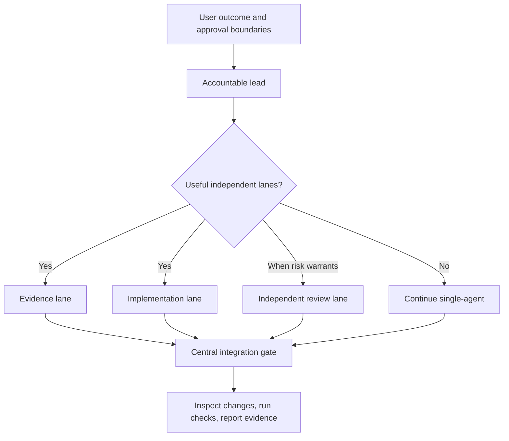

# Orchestrate with Astra

> One accountable lead. Bounded worker lanes. Evidence before claims.

Orchestrate with Astra is an instruction-only Codex skill for complex work that can be divided into independently verifiable lanes. It gives the active coordinator a protocol for useful delegation, exclusive ownership, integration, and proportional verification. Existing installations and `$orchestrate-with-sol-ultra` invocations keep working; the repository and skill identifier retain their original names.

This repository does **not** contain an SDK, model endpoint, worker runtime, or deployment system. It does not upgrade the model already running your task.

> **Project status:** Experimental public-source project. No benchmark results have been published. A legal license is still pending an explicit RSB-HOLDING decision.

## Why this exists

Multi-agent work can finish independent research, implementation, and review lanes concurrently. It can also duplicate work, collide in a shared checkout, hide missing tests, or overstate what was actually proven.

This skill adds a disciplined operating model:

- Keep one lead accountable for the outcome and final truth claim.
- Reserve the strongest available reasoning for architecture, risk, and integration.
- Give workers narrow scopes, explicit stop conditions, and required evidence.
- Allow only one writer in a shared checkout.
- Require isolated worktrees before multiple agents write in parallel.
- Preserve existing authorization and verify its scope before external or destructive actions.
- Continue useful work through clarification, steering, and unavailable dependencies.
- Stop expanding verification once the required checks pass unless new evidence warrants it.

## Astra support and the existing name

The lead preference is now `gpt-6-astra`, following [OpenAI's Astra guidance](https://developers.openai.com/api/docs/guides/latest-model#prompting-best-practices). The update addresses unnecessary permission pauses, conflicting instructions, delegation, task continuity, concise reporting, and excessive verification. These are instruction changes; this repository does not send API requests.

The identifier `orchestrate-with-sol-ultra` stays stable so existing installations, links, and prompts remain valid. Explicit requests for Sol Ultra still prefer `gpt-5.6-sol` with a host-exposed `ultra` configuration. Neither the name nor the skill changes the model already running your task.

Use only models and reasoning settings exposed by the host. Preserve the user's explicit choice and the effective effort unless a supported adjustment is warranted. If overrides are unavailable, workers inherit the active model. An Astra coordinator does not need a replacement Sol lead. Disclose a material fallback once and continue with the available capabilities.

## How it works



The preferred roles are conditional on what the host exposes:

| Role | Preferred configuration | Responsibility |
| --- | --- | --- |
| Lead and final integrator | `gpt-6-astra` | Framing, architecture, decomposition, integration, and final verification |
| Critical reviewer | Independent `gpt-6-astra`, when risk warrants | Security, concurrency, migrations, native boundaries, and irreversible operations |
| Bounded worker | `gpt-5.6-terra`, or inherit the active model | Owned implementation, diagnosis, focused tests, and evidence |
| Evidence worker | `gpt-5.6-luna`, or inherit the active model | Inventory, searches, documentation checks, test execution, and low-risk mechanical work |

Use the [delegation packet](references/delegation-packet.md), with detail proportional to the lane’s risk. The lead inspects the actual result, integrates centrally, runs the appropriate checks, and reports failures and skips explicitly.

## Install

Official Codex documentation supports user-wide skills in `$HOME/.agents/skills`, repository-scoped skills in `.agents/skills`, and symlinked skill directories.

### User-wide installation

macOS or Linux:

```bash
mkdir -p "$HOME/.agents/skills"
git clone https://github.com/RSB-HOLDING/orchestrate-with-sol-ultra.git \
  "$HOME/.agents/skills/orchestrate-with-sol-ultra"
```

Windows PowerShell:

```powershell
New-Item -ItemType Directory -Force "$HOME\.agents\skills" | Out-Null
git clone https://github.com/RSB-HOLDING/orchestrate-with-sol-ultra.git `
  "$HOME\.agents\skills\orchestrate-with-sol-ultra"
```

### Repository-scoped installation

From the repository that should use the skill:

```bash
mkdir -p .agents/skills
git submodule add https://github.com/RSB-HOLDING/orchestrate-with-sol-ultra.git \
  .agents/skills/orchestrate-with-sol-ultra
```

### Install through Codex

You can also invoke `$skill-installer` and ask it to install:

```text
https://github.com/RSB-HOLDING/orchestrate-with-sol-ultra
```

No package installation or API key is required by this repository. Codex detects skill changes automatically; restart Codex if the skill does not appear.

## Validate

The repository includes a zero-dependency structural validator:

```bash
python3 scripts/validate.py
```

It checks the skill frontmatter, required files, UI metadata, Markdown links, and fenced code blocks. CI runs the same validator on pushes and pull requests. For decision-rule changes, use the [behavioral scenarios](docs/BEHAVIORAL-CHECKS.md); structural validation alone does not prove behavior.

## Use

Invoke it explicitly:

```text
$orchestrate-with-sol-ultra

Plan and implement this authentication migration. Split only genuinely
independent lanes, keep one writer per shared checkout, integrate centrally,
run the relevant checks, and report evidence and remaining risks.
```

In Codex CLI or the IDE extension, mention the skill with `$` or use `/skills`. In the ChatGPT desktop app, select it with `@` when that surface supports the skill. The metadata permits implicit invocation, but matching is not guaranteed; explicit invocation is best when you specifically want this workflow.

### Good fits

- A migration with separate inventory, implementation, test, and adversarial-review lanes.
- A cross-stack feature whose frontend and backend work can use isolated ownership.
- Release-readiness work that needs independent evidence and risk review.
- A large diagnosis where several read-only hypotheses can be tested concurrently.

### Poor fits

- Renaming one variable.
- Explaining a function.
- Running one test.
- A tightly sequential change where every step depends on the previous result.
- Work that cannot isolate writers or independently verify worker output.

## Example orchestration

For a database migration, the lead might arrange:

1. Luna inventories migrations, tests, and repository rules without editing.
2. Terra implements one bounded migration lane as the sole writer.
3. An independent Astra reviewer challenges rollback, compatibility, and data-loss assumptions.
4. The lead reviews every change, runs required checks proportional to the change, and reports what is locally proven versus still unverified.

The exact topology must follow the task, host limits, and repository instructions. When the host permits it, delegate useful independent work without a separate permission question. Keep small or tightly coupled work local.

## Safety model

The safety controls are procedural instructions interpreted by the active coordinator; they are not a sandbox or permission system.

- **One writer per shared checkout.** Parallel writers require isolated worktrees or equivalent isolation.
- **Authentication is not authority.** A logged-in CLI, remote, or provider session does not authorize mutation.
- **Authority stays with the lead and user.** Workers do not own destructive actions, external publication, provider spending, signing, releases, or final scope decisions. The lead checks authority already granted for the target; the user need not repeat it without a material scope change.
- **Read-only discovery is separate from mutation.** A worker may use scoped read-only GitHub commands when the host and task permit them. A logged-in session does not authorize writes.
- **Evidence is mandatory.** Worker returns include revisions, Git status, exact changes, generated artifacts, commands, failures, assumptions, and risks.
- **The lead verifies.** Summaries are not accepted on trust; actual changes and checks are inspected centrally.

The skill does not itself prevent a model or tool from behaving incorrectly. Host policy, repository instructions, permissions, and human review remain essential.

## Performance and usage: what can honestly be claimed

The skill creates **potential concurrency**, not guaranteed acceleration.

On a host with four total agent slots, one coordinator can have at most three workers active alongside it—and only when three useful independent lanes exist. That is three concurrent worker lanes, not a promise of three-times-faster delivery.

Delegating bounded work to Terra or Luna may reduce the share of work performed by the most expensive model tier. Total tokens can still increase because workers receive context, reason independently, and return evidence. Coordination and integration also add overhead.

There are currently no published evals proving a speed, quality, token, or cost improvement for this skill. See [Benchmarking](docs/BENCHMARKING.md) for the measurement protocol required before making quantitative claims.

## Limitations

- Model names, reasoning settings, concurrency, and collaboration tools depend on the host and account.
- The skill does not change the active coordinator’s model.
- It does not provision agents, sandboxes, worktrees, credentials, or provider access.
- It does not use the Responses API Multi-agent beta, Pro mode, or a separate “Sol Ultra” API model.
- It does not enforce its safety rules programmatically.
- Implicit invocation is allowed but not deterministic.
- Standalone installation does not guarantee identical behavior across Codex surfaces.
- Tiny or highly coupled tasks may become slower because orchestration has overhead.

## Repository map

```text
.
├── SKILL.md                         # Activation metadata and core workflow
├── agents/openai.yaml              # Codex UI and invocation metadata
├── references/delegation-packet.md # Mandatory worker packet and acceptance checks
├── scripts/validate.py              # Zero-dependency structural validation
├── docs/BENCHMARKING.md            # Honest evaluation and reporting protocol
├── docs/BEHAVIORAL-CHECKS.md       # Decision-rule regression scenarios
├── CONTRIBUTING.md                 # How to propose and validate changes
├── SECURITY.md                     # Private vulnerability-reporting policy
└── .github/                        # Validation CI, issue forms, and PR checklist
```

## Update

For a user-wide clone:

```bash
git -C "$HOME/.agents/skills/orchestrate-with-sol-ultra" pull --ff-only
```

Restart Codex only if the updated skill is not detected automatically.

## FAQ

### Does this upgrade my current task to Astra?

No. It can prefer host-exposed configurations for delegated roles, but it cannot replace or silently upgrade the active coordinator.

### Is it guaranteed to be faster or cheaper?

No. Cleanly divided tasks may finish sooner and may shift work to lower-cost tiers. Total tokens, latency, quality, and cost must be measured on representative work.

### Can workers push code or open pull requests?

The lead owns external mutations and verifies the exact target and current authorization before acting. Workers prepare and verify their assigned local changes. Scoped read-only `gh` calls may be delegated. Existing authorization remains valid for the same scope; authentication alone grants none.

### What happens if the preferred models are unavailable?

The coordinator uses only capabilities exposed by the host, discloses any fallback, and continues single-agent when safe delegation is unavailable.

### Where is the worker-assignment format?

See [`references/delegation-packet.md`](references/delegation-packet.md).

## Contributing and security

Contributions are welcome; read [CONTRIBUTING.md](CONTRIBUTING.md) before opening a pull request. Do not disclose vulnerabilities or sensitive data in a public issue—follow [SECURITY.md](SECURITY.md).

## License

No license has been selected yet. Public visibility does not grant permission to copy, modify, or redistribute the project. RSB-HOLDING must choose an explicit license before this project can accurately be described as open source.

## References and independence

- [Official OpenAI documentation: Build skills](https://developers.openai.com/codex/build-skills)
- [Official OpenAI documentation: GPT-6 Astra model guidance](https://developers.openai.com/api/docs/guides/latest-model)

This is an independent community project maintained by RSB-HOLDING. It is not an official OpenAI skill and is not endorsed by OpenAI. OpenAI, Codex, and GPT model names are trademarks of their respective owner.
